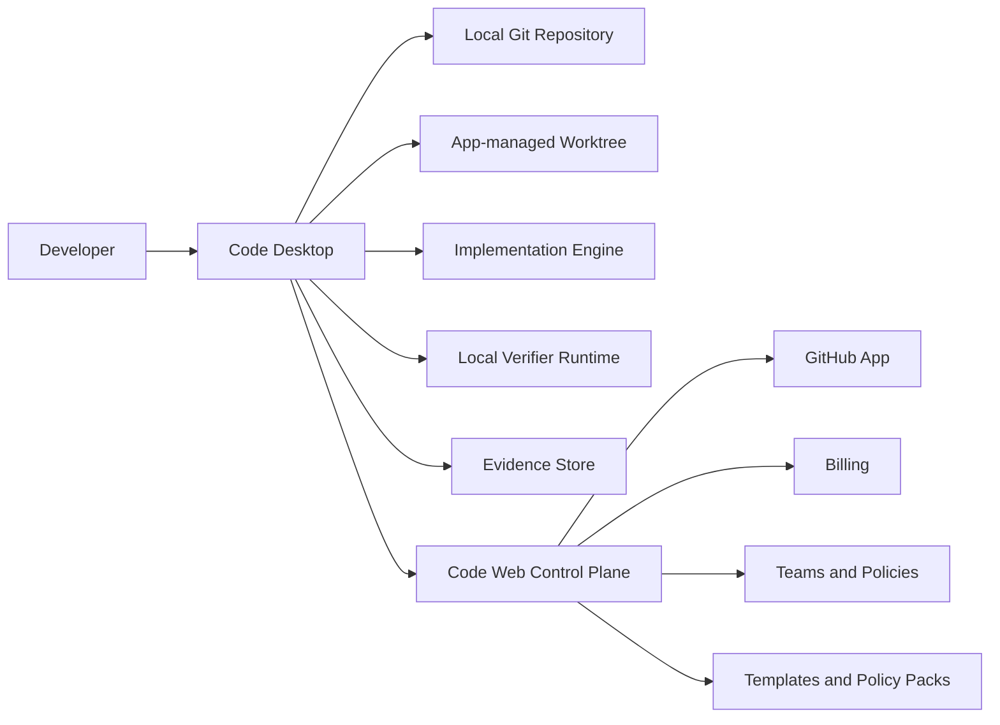

# Code Platform Strategy

Last updated: 2026-06-23

## Thesis

Code should become a verified AI change platform.

The product should not compete as another AI editor, chat-to-code surface, or no-code website
builder. Its defensible wedge is the trust layer around AI-generated software changes: local-first
execution, explicit approvals, policy-defined verification gates, reviewable evidence, and verified
branches.

The promise:

> Delegate software changes to AI. Accept only the work that proves itself.

The platform direction:

- Desktop is the execution plane: local repositories, local worktrees, verifier runtime, approvals,
  evidence, and branch acceptance.
- Web is the control plane: users, teams, GitHub integration, tickets, runs, dashboards, policy
  sharing, billing, and marketplace distribution.
- The long-term platform is engine-agnostic: Codex first, with room for other coding engines and
  hosted or self-hosted runners later.

## Why Now

AI coding adoption is high, but developer trust is not.

Stack Overflow's 2025 Developer Survey reports broad AI tool adoption and intent, while also
showing that more developers distrust AI accuracy than trust it. DORA's research shows AI can
improve individual productivity and flow, but software delivery outcomes still depend on strong
engineering fundamentals such as small batches, robust testing, and stable review practices. METR's
2025 randomized study on experienced open-source developers found that early-2025 AI tooling slowed
participants down in familiar mature repositories, which reinforces the need for scoped delegation,
verification, and evidence rather than blind autonomy.

Competitors are racing toward agents:

- GitHub Copilot is moving agent work into GitHub branches, issues, pull requests, and Actions.
- OpenAI Codex positions itself as an agent command center for parallel coding work.
- Claude Code spans terminal, IDE, cloud, GitHub, hooks, skills, and MCP.
- Cursor competes from the editor with agent workflows, privacy mode, team controls, and usage
  analytics.
- Devin competes as an enterprise cloud agent for multi-repo teams.
- Replit, Lovable, v0, and similar tools own the idea-to-app and nontechnical builder lane.

The opening for Code is a narrower, sharper category:

> Verified agentic development for teams that care what gets merged.

## Current Product Assets

The repo already has the foundations of a platform rather than a single feature.

### Execution Plane

The desktop runtime stores local MVP state under app data, including SQLite metadata, worktrees,
sessions, patches, logs, screenshots, traces, and assertions. See
`.docs/code-desktop-runtime.md`.

Important current capabilities:

- App-managed Git worktrees are created from committed `HEAD`.
- Dirty source working trees are excluded from session input.
- Acceptance creates a local branch in the source repository.
- The pinned verifier image runs gates in local Docker.
- Only the install gate receives network access by default.
- Other gates and browser verification run without external network access.
- Distribution is already thought through for signed macOS `.app` and `.dmg` bundles.

### Contracts

The `@workspace/code-agent-contracts` package already describes platform-level primitives:

- Repositories and repository policies.
- Change sessions.
- Session status transitions.
- Session events.
- Verification snapshots.
- Gate results.
- Safety checks.
- Artifacts.
- Verification manifests.

This is valuable because contracts can become the public API surface for desktop, web, reports,
runners, and future marketplace packages.

### Engine Abstraction

The Tauri backend has an `ImplementationEngine` trait with thread start, resume, turn start, status,
interrupt, dynamic tool, and approval response methods. This should become the internal engine
adapter boundary.

Near-term: Codex only.

Long-term: multiple engines and runner modes:

- Codex local.
- Codex cloud if exposed through a stable interface.
- Claude Code.
- OpenAI API-based internal agent.
- Self-hosted enterprise runner.
- Marketplace or partner engines.

### Control Plane

The Convex schema already includes:

- User profiles and settings.
- Desktop registrations.
- GitHub installations.
- Repositories.
- Tickets.
- Runs.
- Gate results.

This can become the team and business platform layer without disrupting the local execution loop.

## Product Category

Category name:

> Verified AI change platform

Alternative names:

- Verified agentic development platform.
- Local-first AI development control plane.
- AI change management for engineering teams.
- Evidence-based coding agents.

Best short positioning:

> Code turns AI coding sessions into verified branches with local execution, policy gates, and
> reviewable evidence.

## Target Customers

### Initial Customer Profile

The first users should be technically strong and already AI-curious:

- Founders who use AI coding tools but still personally review every change.
- Senior engineers at small teams with a backlog of bugs, tests, and maintenance work.
- Agencies that need to show clients proof that AI-assisted work was verified.
- Teams with private codebases that prefer local execution over hosted agents.

### Later Customer Profile

After team controls exist:

- Engineering managers at 10-100 person product teams.
- Security-conscious SaaS teams.
- Regulated engineering teams that need audit logs and retention controls.
- Enterprises that want AI coding productivity without shipping unverified AI output.

## Jobs To Be Done

Primary job:

> When I delegate a code change to AI, I want proof that it was implemented, checked, and safe to
> review so I can merge faster without lowering standards.

High-value tasks:

- Fix a bug with tests.
- Add or update tests.
- Upgrade a dependency.
- Repair failing typecheck, lint, build, or unit tests.
- Make small UI changes and capture browser evidence.
- Refactor a bounded module.
- Generate a PR from a ticket.
- Produce an evidence report for review.

Avoid first:

- Large feature rewrites.
- Ambiguous product work.
- Full app generation.
- Multi-repo architectural migrations.
- Unsandboxed production operations.

## Differentiation

Code should differentiate on proof, locality, and governance.

| Competitor lane | Their center of gravity | Code's wedge |
| --- | --- | --- |
| AI editors | In-editor completion and chat | Verified branch workflow outside editor lock-in |
| Cloud coding agents | Hosted autonomy and PRs | Local-first execution with evidence and approvals |
| App builders | Idea-to-deployed app | Real repo maintenance and trusted changes |
| CI/CD | Validate committed code | Validate AI work before acceptance |
| Code review tools | Review after a PR exists | Produce evidence before PR/review |

The product should not claim that AI always makes developers faster. It should claim that Code
makes AI-generated changes easier to inspect, verify, recover, and govern.

## MVP

### MVP Promise

For a Bun TypeScript repository on Apple Silicon macOS:

1. Open a local Git repository.
2. Approve a verification policy.
3. Describe a bounded change.
4. Let the agent work in an isolated worktree.
5. Review activity, approvals, diff, gates, and artifacts.
6. Accept only if verification is fresh and complete.
7. Create a local branch, and later a GitHub pull request.

### MVP Scope

Must have:

- Local repository onboarding.
- Runtime health checks.
- Policy proposal and approval.
- Isolated session worktrees.
- Agent session lifecycle.
- Approval queue for risky operations.
- Verification gates:
  - install
  - typecheck
  - lint
  - build
  - unit
  - e2e
  - visual
- Safety checks:
  - diff
  - secrets
  - symlinks
  - file size
  - file mode
  - policy
  - stability
- Evidence artifacts:
  - patch
  - command log
  - screenshot
  - Playwright trace
  - assertions
  - report
- Fresh verification enforcement before acceptance.
- Accept branch.
- Discard session.
- Signed/notarized desktop package.
- Basic analytics with allowlisted metadata only.
- First-run onboarding.
- Sample repo/demo task.

Should have for beta:

- GitHub PR creation from accepted branch.
- Markdown and JSON evidence report export.
- Redaction rules for logs and artifacts.
- Better failure recovery and retry guidance.
- Landing page and waitlist.
- Install docs.

Out of scope for MVP:

- Hosted cloud execution.
- Windows and Linux.
- Multi-user orgs.
- Billing.
- Marketplace.
- Non-Bun package managers.
- Full app deployment.
- Multi-engine routing.

## Platform Architecture

### System Model

### Planes

Execution plane:

- Tauri desktop.
- Local SQLite.
- Git worktrees.
- Docker verifier image.
- Browser controller and verifier.
- Artifact storage.
- Approval handling.
- Engine adapter.

Control plane:

- TanStack web app.
- Convex backend.
- WorkOS auth.
- GitHub App.
- Desktop heartbeat.
- Tickets and runs.
- Team policies.
- Billing.
- Reports and dashboards.

### Future Platform Primitives

Formalize these as product and code concepts:

- `EngineAdapter`: implements the coding agent interface.
- `Runner`: local desktop, hosted cloud, VPC, or self-hosted.
- `VerificationManifest`: repo policy and gate contract.
- `PolicyPack`: reusable security, quality, framework, or team rule bundle.
- `GateRunner`: gate execution and result capture.
- `EvidenceReport`: portable proof bundle for PRs and audits.
- `TaskTemplate`: repeatable prompt plus acceptance criteria.
- `Connector`: GitHub, Linear, Jira, Slack, Sentry, PostHog, Vercel.
- `MarketplaceItem`: template, policy pack, connector, gate, or workflow.

## Validation Plan

### Research Questions

Discovery should answer:

- Which AI-delegated tasks are painful but bounded enough for high success?
- What evidence makes a developer comfortable reviewing or merging AI code?
- Which failures are acceptable if recovery is clear?
- Do users prefer local execution enough to install desktop software?
- Which workflow should start the session: local app, GitHub issue, ticket, or CLI?
- What would teams pay for: local execution, reports, policy, PR automation, or audit?

### Interview Targets

Run 35 interviews:

- 15 founders or technical founders.
- 10 senior/staff engineers.
- 5 agency owners or leads.
- 5 engineering managers.

### Pilot Targets

Run 10 concierge pilots:

- 3 solo founders.
- 3 small product teams.
- 2 agencies.
- 2 security-conscious teams.

### Validation Metrics

Activation:

- Repo opened.
- Policy approved.
- First session started.
- First verified branch accepted.

Quality:

- Verified sessions per active user.
- Accepted branch rate.
- Gate pass rate.
- Verification stale rate.
- Human rework after acceptance.

Trust:

- Report viewed before acceptance.
- Artifact viewed before acceptance.
- Approval decisions per session.
- User-reported merge confidence.

Business:

- Willingness to pay.
- Team invite requests.
- Requests for GitHub PR workflow.
- Requests for shared policies.

## Go-To-Market

### Landing Page

H1:

> Merge AI-written code only after it proves itself.

Subhead:

> Code runs AI coding sessions in isolated local worktrees, verifies them with policy gates, and
> turns passing work into reviewable branches with evidence.

Primary CTA:

> Join the desktop beta

Secondary CTA:

> Watch a verified branch demo

First screen proof points:

- Local-first execution.
- Policy-defined verification.
- Reviewable diff, logs, screenshots, and traces.
- Fresh verification required before branch acceptance.

Demo script:

1. Open a Bun TypeScript repo.
2. Approve detected verification policy.
3. Ask Code to fix a failing test or UI bug.
4. Watch the agent produce changes.
5. Show approvals and event timeline.
6. Show gates, screenshot, trace, and diff.
7. Accept a verified branch.
8. Attach evidence to a PR.

### Launch Narrative

The narrative should be practical and skeptical:

- AI can write code.
- Developers still need proof.
- Review is overloaded.
- CI catches too late and lacks agent context.
- Code makes AI work auditable before it reaches PR review.

### Content Pillars

- The AI code trust gap.
- Verified branch workflows.
- Local-first AI development.
- Agent task recipes.
- Verification manifest examples.
- Failure stories and recovery patterns.
- Security and auditability for AI-assisted code.

### Channels

- Founder-led build-in-public.
- Hacker News launch.
- Product Hunt launch.
- X and LinkedIn technical demos.
- YouTube walkthroughs.
- GitHub example repos.
- Bun, Tauri, TypeScript, local-first, and AI engineering communities.
- Agency and founder communities.

## Sales Motion

Start product-led, then add founder-led sales for teams.

Free users should get the local verified branch loop. Paid plans should unlock collaboration,
history, policy sharing, dashboards, PR reports, and governance.

Best first sales triggers:

- User accepted multiple verified branches.
- User exports reports.
- User wants GitHub PR creation.
- User asks to share reports with teammates.
- User wants a team policy.
- User has multiple repos.

## Monetization

Suggested initial pricing:

- Free: local desktop, limited repos, limited monthly verified sessions, basic evidence report.
- Pro, around 20 USD per month: unlimited local repos, report export, GitHub PR helper, templates,
  artifact history, personal analytics.
- Team, around 40 USD per user per month: shared policies, team dashboard, GitHub org integration,
  ticket workflow, audit logs, centralized billing.
- Enterprise, custom: SSO and SCIM, retention controls, VPC or self-hosted runners, private
  marketplace, dedicated support, procurement and security review.

Potential usage add-ons:

- Hosted runner minutes.
- Browser and visual verification minutes.
- Advanced security scans.
- Long-running agent sessions.
- Marketplace premium packs.

## Growth Loops

PR report loop:

- Every accepted branch can produce a "Verified by Code" report.
- Reports appear in PR descriptions.
- Teammates see proof and ask how it was generated.

Template loop:

- Successful prompts become task templates.
- Teams reuse and share templates.
- Public templates drive discovery.

Policy loop:

- Users improve verification manifests.
- Teams standardize policy packs.
- Policy packs become marketplace items.

Benchmark loop:

- Opt-in anonymized session data reveals which tasks AI agents actually complete.
- Public benchmark content creates trust and search demand.

Agency loop:

- Agencies use reports as client-facing proof.
- Clients ask for the same quality process.

## Roadmap

### Stage 0: Kickoff

Duration: 1 week.

Outcomes:

- Product thesis agreed.
- MVP scope frozen.
- Pilot target list created.
- Landing page copy drafted.
- First demo repo selected.
- First sprint backlog ready.

### Stage 1: Discovery

Duration: 2 weeks.

Outcomes:

- 35 customer interviews.
- Task taxonomy.
- Trust evidence ranking.
- Pricing signal.
- Pilot cohort selected.

### Stage 2: Concierge Validation

Duration: 2-3 weeks.

Outcomes:

- 10 real repo pilots.
- 50 real sessions.
- Failure taxonomy.
- Evidence report v1.
- Go/no-go on beta.

### Stage 3: MVP Hardening

Duration: 4-6 weeks.

Outcomes:

- First-run onboarding.
- Sample repo and demo task.
- PR creation from accepted branch.
- Report export.
- Signed desktop beta package.
- Install docs.
- Product analytics.
- Recovery UX.

### Stage 4: Private Beta

Duration: 4-6 weeks.

Outcomes:

- 20-50 active beta users.
- Weekly office hours.
- 100+ sessions.
- 30+ accepted branches.
- 3+ paying design partners.

### Stage 5: Public Launch

Duration: 2 weeks.

Outcomes:

- Public landing page.
- Demo video.
- HN/Product Hunt launch.
- GitHub examples.
- Docs and install guide.
- 1,000 signups.
- 300 installs.
- 100 activated repos.

### Stage 6: Team Product

Duration: 8-12 weeks.

Outcomes:

- Orgs and teams.
- Shared policies.
- Team run history.
- GitHub PR comments.
- Billing.
- Team dashboard.
- Audit logs.

### Stage 7: Platform Expansion

Duration: 3-6 months.

Outcomes:

- More package managers.
- Linux support.
- Hosted runners.
- Multi-engine adapters.
- Connectors.
- Marketplace.
- Recurring and event-triggered tasks.

## North Star

North star metric:

> Accepted verified branches per active team per week.

Supporting metrics:

- Activation rate from install to first accepted branch.
- Median time to first verified branch.
- Session completion rate.
- Verified-to-accepted ratio.
- Gate failure distribution.
- Rework after acceptance.
- Weekly active teams.
- Reports attached to PRs.
- Team conversion rate.

## Risks

### Competitive Compression

GitHub, Cursor, OpenAI, Anthropic, and Devin can copy parts of the workflow.

Mitigation:

- Own verification depth, evidence portability, and local-first execution.
- Become engine-agnostic over time.
- Build workflow trust, not model novelty.

### MVP Too Broad

Trying to become IDE, agent, CI, marketplace, and team dashboard at once will slow launch.

Mitigation:

- Freeze MVP around local verified branch workflow.
- Treat web as waitlist, GitHub setup, reports, and later control plane.

### Verification Friction

Users may find policy approval, Docker, and gates too heavy.

Mitigation:

- Provide a sample repo and one-click demo.
- Auto-detect manifests.
- Explain failures in plain language.
- Make evidence useful, not ceremonial.

### Trust Claims

Overclaiming productivity will backfire.

Mitigation:

- Market evidence and reviewability.
- Publish real pass/fail data.
- Avoid "10x developer" language.

## Source Links

- Stack Overflow 2025 Developer Survey, AI:
  https://survey.stackoverflow.co/2025/ai
- DORA 2024 Accelerate State of DevOps Report:
  https://dora.dev/research/2024/dora-report/
- DORA 2025 State of AI-assisted Software Development:
  https://cloud.google.com/resources/content/2025-dora-ai-assisted-software-development-report
- METR early-2025 AI developer productivity study:
  https://metr.org/blog/2025-07-10-early-2025-ai-experienced-os-dev-study/
- GitHub Copilot cloud agent docs:
  https://docs.github.com/copilot/concepts/agents/cloud-agent/about-cloud-agent
- OpenAI Codex app announcement:
  https://openai.com/index/introducing-the-codex-app/
- Claude Code docs:
  https://code.claude.com/docs/en/overview
- Claude Code web quickstart:
  https://code.claude.com/docs/en/web-quickstart
- Cursor pricing:
  https://cursor.com/pricing
- Devin:
  https://devin.ai/
