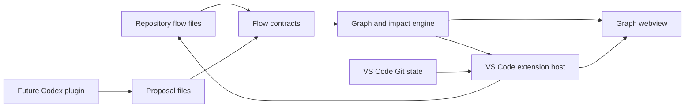

# Behavior Flows Architecture

## Topology



## Package Boundaries

### `@workspace/behavior-flow-contracts`

Owns:

- TypeScript domain types.
- Runtime parsing and validation.
- Stable serialization.
- Cross-reference validation.
- Proposal validation.
- Schema-version migration entrypoints.

It must not depend on VS Code, React, Git, or a layout library.

### `@workspace/behavior-flow-engine`

Owns:

- Behavior graph projection.
- Deterministic node and edge identifiers.
- Graph-diff calculation.
- Source-reference indexing.
- Changed-path impact analysis.
- Layout input and output contracts.

It may depend on the contracts package and a host-independent layout library. It must not import the
VS Code API.

### `apps/behavior-flows-vscode`

Owns:

- Extension activation and commands.
- Workspace discovery and file watching.
- VS Code diagnostics.
- Sidebar tree providers.
- Git change-path integration.
- Proposal lifecycle and explicit application.
- Webview lifecycle and message transport.
- Webview React entrypoint and editor presentation.

The extension host reads and writes files through VS Code workspace APIs. The webview never receives
arbitrary filesystem access.

### `plugins/behavior-flows-codex`

Deferred until the core MVP is stable. It may bundle:

- a behavior-maintenance skill;
- an MCP server that reads approved flows and writes proposals;
- a `Stop` hook that asks for impact analysis after behavior-changing turns.

The plugin writes proposals only. It cannot approve or directly replace behavior contracts.

## Repository Storage

```text
.product-flows/
  config.json
  flows/
    login.json
    password-reset.json
  proposals/
    01J...json
```

- `config.json` and `flows/` are intended for Git.
- `proposals/` contains reviewable pending changes. Teams may commit proposals for collaboration or
  ignore them for local-only review.
- UI viewport, expanded groups, and selection state belong in VS Code workspace state, not flow
  files.

## Extension Surfaces

### Sidebar

Use a native Tree View for:

- flows;
- invalid files;
- affected-flow indicators;
- pending proposals.

### Graph Editor

Use a webview panel or custom text editor in the editor area. The MVP should begin with a webview
panel because approved files may span multiple flow documents and proposal overlays.

The graph editor contains:

- graph canvas;
- flow title and status;
- compact legend;
- selected-item inspector;
- proposal decision controls when applicable.

### Diagnostics

Map validation issues to JSON file ranges where possible. Cross-file issues without a precise range
may target the flow or proposal root.

## Data Flow

1. File watcher reports a relevant change.
2. Extension host reads text through `workspace.fs`.
3. Contracts package parses and validates documents.
4. Engine projects valid documents into graph data.
5. Extension sends serializable graph data to the webview.
6. Webview renders and sends user intents back to the host.
7. Host applies accepted edits through `WorkspaceEdit`.
8. File watcher causes a full canonical reload.

The webview must not maintain an independent authoritative copy after writes.

## Git Integration

For the MVP, changed paths are enough. Use the built-in Git extension API when available and degrade
to no impact information when it is unavailable. Do not execute arbitrary shell commands merely to
render flows.

Impact is advisory:

```text
changed path intersects source reference -> potentially affected
```

Absence of a source match does not prove a flow is unaffected.

## Layout

The engine supplies layout-ready nodes and edges. A directed layout implementation may use ELK.js.
Layout must be deterministic for identical semantic input.

Approved files never store computed coordinates. Optional manual positions, if introduced later,
must live in a separate presentation document keyed by semantic IDs.

## Security

- Treat repository strings as untrusted content.
- Use a strict webview content security policy with nonces.
- Disable arbitrary script evaluation.
- Do not render raw HTML from flow labels or proposal reasoning.
- Confine writes to `.product-flows/`.
- Validate a proposal again immediately before applying it.
- Never accept a proposal because its producer claims it is valid.

## Testing Layers

- Contract tests: parsing, validation, migration, serialization.
- Engine tests: projection, diff, impact, deterministic identity.
- Webview component tests: graph states and inspector behavior.
- Extension tests: workspace discovery, diagnostics, commands, and edits.
- Fixture repositories: valid, invalid, affected, proposed, accepted, and rejected cases.

