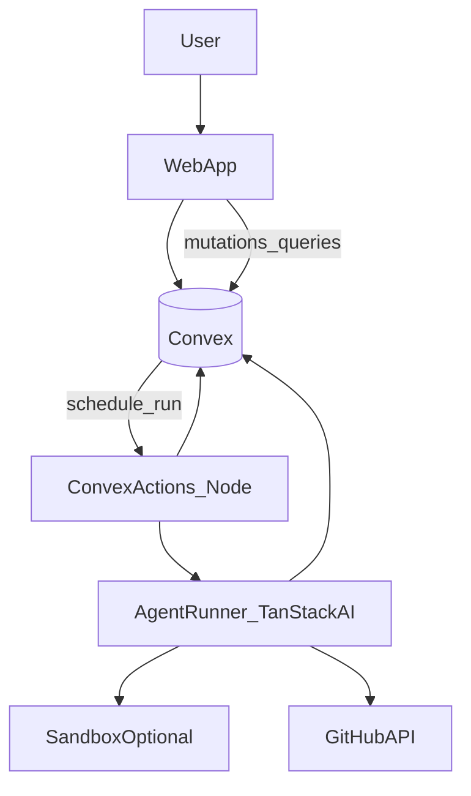

# Code PR Agent Architecture

This document is a living architecture record. Update it after each milestone.

## Current State

- Planning and implementation contracts completed (see [concept.md](./concept.md), [contracts.md](./contracts.md)).
- **`apps/code`** is the Code PR Agent web app (TanStack Start + Convex + WorkOS), sharing stack glue via **`@workspace/web-foundation`** with `apps/trading`.
- Convex schema and stub run path for tickets/repos/messages/runs live under `apps/code/convex/`.

## Target State

A web application where:

- tickets and chat threads live in a backend the UI can subscribe to or query efficiently;
- long-running or rate-limited work (git operations, LLM calls) runs in **Convex actions** (Node runtime where required) or in an external worker if isolation demands it;
- GitHub receives branches and PRs created on behalf of an installation or bot account with least privilege;
- every meaningful step is persisted for audit and replay analysis.

## System Topology

**Notes:**

- The diagram shows Convex as the control plane. If the team later introduces a dedicated **sandbox worker** (containers, VM, or managed CI) for `git` + build + test, treat it as an implementation detail behind the same `AgentRunner` boundary: the worker receives a sealed job payload and returns diffs or patch bundles; secrets never flow to the browser.
- **MVP path:** Convex actions invoke the agent and GitHub directly; document limits (timeouts, disk, concurrent runs) before moving heavy work to a sandbox.

## Key Components

### Web application

- Ticket list and detail views, run timeline, PR link, and chat thread.
- Triggers: “start run”, “cancel” (best-effort), “retry” with optional instruction prefix.
- Surfaces errors from GitHub and from the agent in structured form (not only raw stack traces).

### Convex (or equivalent) control plane

- **Mutations** for ticket CRUD, message append, run state transitions.
- **Queries** for real-time UI; index by `ticketId`, `runId`, `status`.
- **Actions** for LLM + git + GitHub calls; write results back via internal mutations.
- **Scheduler / crons** (optional) for stale-run cleanup, webhook reconciliation, or retries.

### Agent runner

- Uses `@tanstack/ai` (per monorepo standard) to orchestrate model calls and tools.
- Tools might include: read file, search, apply patch, run formatter/linter in sandbox (later), create commit metadata, push branch, open/update PR.
- Emits **structured events** appended to a `run` record for observability.

### GitHub integration

Responsible for:

- creating a branch from a configured base (usually `main`);
- applying changes and pushing commits;
- opening a PR with title/body linked to the ticket;
- updating an existing PR when the user requests follow-up work on the same ticket branch strategy.

## GitHub App vs Personal Access Token (PAT)

| Dimension | GitHub App (installation) | PAT (fine-grained or classic) |
|-----------|---------------------------|-------------------------------|
| Security | Short-lived installation tokens; org admins can scope by repo | Long-lived secret; higher blast radius if leaked |
| Auditing | Actor shows as the app; clearer org governance | Actor tied to user or bot user |
| Rotation | GitHub handles token refresh | Manual rotation burden |
| MVP speed | More setup (app registration, webhook optional) | Faster to prototype for a single admin user |

**Recommendation for MVP documentation:** prefer **GitHub App** once there is more than one user or repo; allow **PAT** only for single-operator prototypes with strict secret storage and repo allowlists.

### Phase 0 decisions (first deployment)

| Decision | Choice | Rationale |
|----------|--------|-----------|
| **GitHub auth (first deploy)** | **GitHub App** installation scoped to specific repositories | Short-lived installation tokens, clearer audit actor, alignment with [safety-and-governance.md](./safety-and-governance.md). PAT remains acceptable only for a deliberate single-operator prototype with fine-grained PAT, strict server-side storage, and the same server-side allowlist checks. |
| **MVP repo scope** | **Small allowlist** (configurable list, typically 1–5 `owner/name` pairs per environment) | Matches [mvp.md](./mvp.md) (“one repository” pilot with headroom for a few repos) without unbounded org-wide access. |
| **Model provider and cost envelope** | **`@tanstack/ai`** with provider credentials from server env (e.g. OpenAI or Anthropic; exact env names TBD in implementation) | Matches [AGENTS.md](../../AGENTS.md). **Envelope:** log token usage per `Run` where the SDK exposes it; set a **soft default cap** (e.g. pause new enqueues when aggregate daily spend or run count exceeds a dashboard-configured threshold) and surface operator-visible warnings before hard stops. Hard limits and billing alerts are an implementation follow-up. |

## Webhooks (future enhancement)

Inbound GitHub webhooks can:

- mark PRs merged/closed and sync ticket status;
- ingest review comments (optional: “address feedback” flows).

Initial MVP can **poll PR URL** or rely on manual refresh to reduce moving parts.

## Data Model Sketch

Concrete schema belongs in implementation; this sketch guides tables and indexes.

| Entity | Purpose | Key fields (illustrative) |
|--------|---------|---------------------------|
| `repos` | Allowlisted GitHub targets | `owner`, `name`, `defaultBranch`, `installationId` or PAT ref id |
| `tickets` | Internal issues | `title`, `body`, `status`, `repoId`, `createdBy`, timestamps |
| `threads` | Chat container | `ticketId`, optional `primaryRunId` |
| `messages` | User/assistant turns | `threadId`, `role`, `content`, `createdAt`, optional `toolCallRefs` |
| `runs` | Agent execution | `ticketId`, `status`, `trigger` (user, retry, webhook), `baseBranch`, `headBranch`, `prNumber`, `prUrl`, `error`, `startedAt`, `finishedAt` |
| `run_events` | Fine-grained trace | `runId`, `type` (tool, model, git, policy), `payload`, `createdAt` |
| `credentials` | Secret handles | never store raw tokens in documents; use env / Convex dashboard / secret manager pattern chosen at implementation time |

**Indexes:** by `ticketId` for runs and messages; by `status` for operator dashboards; by `repoId` for multi-repo installs.

## Integration Points

- **GitHub REST or GraphQL:** branches, commits, PRs, optionally checks. Respect rate limits; batch where possible.
- **Internal tickets:** Convex tables as the system of record until an external **IssueAdapter** interface is introduced (`JiraAdapter`, `LinearAdapter`) mapping external keys to `ticketId`.

## Failure Modes and Persistence

- Runs should end in explicit terminal states: `succeeded`, `failed`, `cancelled`, `needs_input`.
- Partial progress (e.g. branch pushed but PR creation failed) must be recoverable: store `headBranch` and last good SHA; next run can retry PR creation.
- Conflicts with `defaultBranch` should surface as user-visible `needs_input` with fetch/rebase strategy documented in [mvp.md](./mvp.md).

## Related Documents

- [contracts.md](./contracts.md) — run state machine and public vs internal mutation boundaries.
- [mvp.md](./mvp.md) — minimal slice and requirements.
- [implementation-roadmap.md](./implementation-roadmap.md) — delivery phases.
- [safety-and-governance.md](./safety-and-governance.md) — permissions and policy.
