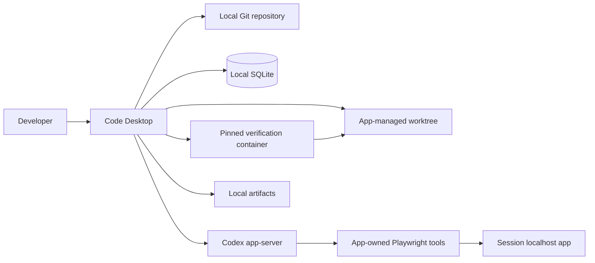

# Code MVP Architecture

## Topology

## Desktop Responsibilities

- Register repositories and report committed `HEAD`, dirty state, platform, and Bun compatibility.
- Discover, validate, fingerprint, approve, and invalidate repository verification policies.
- Create and remove app-managed worktrees without writing to the source working tree.
- Persist repositories, policies, sessions, events, gate results, approvals, and artifact metadata.
- Own lifecycle transitions, bounded attempts, cancellation, crash recovery, and acceptance.
- Present readiness, request entry, conversation, activity, diff, verification, and evidence.

## Codex Runtime

- One persistent app-server thread belongs to each active change session.
- The thread working directory and runtime workspace root are the session worktree.
- Workspace writes are allowed; external paths, network, secrets, and privileged actions require
  explicit approval.
- Structured gate failures and selected evidence return to the same thread for repair.
- Interrupted sessions retain their thread and worktree metadata for explicit continuation.

## Browser Runtime

- Code exposes dynamic app-server tools backed by Playwright.
- Tools support relative navigation, accessibility/DOM inspection, click, fill, key press, state
  waits, screenshots, and console/page-error inspection.
- The application server and browser use the pinned container with network disabled.
- Navigation is confined to the approved localhost origin; arbitrary script evaluation is absent.
- Exploratory browser state persists during an implementation or repair turn and resets before
  authoritative E2E verification.

## Verification Runtime

- Commands are argument arrays and execute without an implicit shell.
- Install runs with network enabled; every other gate runs with network disabled.
- Gates run in a fixed order against the session worktree.
- Safety checks and gate results record the same worktree digest.
- A changed digest invalidates the complete verification snapshot.
- Verification metadata is stored outside the worktree.

## Persistence And Recovery

- Versioned SQLite migrations own repositories, policies, sessions, events, gates, approvals, and
  artifacts.
- App-data folders own worktrees and evidence.
- Startup marks active sessions `needs_input`, preserves their worktrees, and never resumes processes
  automatically.
- `accepted` and `discarded` are final. Failed, cancelled, and `needs_input` sessions can continue.

## Security Boundaries

- Code checks Codex login status but never reads or copies Codex credentials.
- Source repositories are read for Git metadata and used only to create worktrees.
- Artifact access is confined to app-managed storage.
- Newly added escaping symlinks and files larger than 5 MiB fail verification.
- Secret findings are redacted and never sent to telemetry.
- Network, external paths, and browser origins fail closed unless the approved policy allows them.
