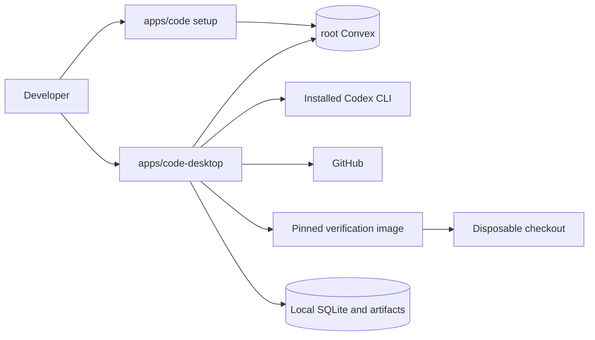

# Local Code Agent Architecture

## Topology

## Responsibilities

### Desktop

- WorkOS browser authentication with refresh credentials in macOS Keychain.
- Repository setup parity, task creation, Codex and Docker readiness checks.
- Exact-SHA checkout, local Codex execution, bounded repair, cancellation, and patch generation.
- Local event, artifact, screenshot, and trace review.
- Menu-bar continuation and explicit confirmation before quitting an active run.

### Root Convex

- WorkOS identity and ownership enforcement.
- GitHub installations, repositories, approved manifests, tasks, desktop registrations, runs, and gates.
- Independent verification-summary calculation before accepting `verified`.
- No local paths, provider credentials, patches, logs, screenshots, or traces.

### Web

- Account onboarding, GitHub installation, repository selection, manifest approval, and desktop guidance.
- No task execution, run history, evidence review, cancellation, or retry.

### Local Execution

- Codex edits only an app-managed checkout using `workspace-write`.
- Docker runs each approved command directly without an implicit shell.
- The verification image is pinned as `code-agent-verifier:1`.
- Interrupted local runs become recoverable `needs_input` records and never silently resume.
