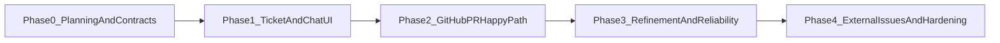

# Code PR Agent Implementation Roadmap

## Objective

Deliver a ticket-driven coding agent that opens and iterates GitHub PRs in controlled phases:

1. planning and contracts
2. ticket UI, chat, and manual agent trigger (without full GitHub automation if needed for scaffolding)
3. GitHub PR automation for the happy path
4. conversational refinement, reliability, and operator tooling
5. external issue trackers and production hardening

## Milestone Timeline (phase-based)

## Phase 0: Planning and Contracts

**Status:** complete — proceed to Phase 1 when ready.

### Goals

- Finalize [concept.md](./concept.md), [architecture.md](./architecture.md), [mvp.md](./mvp.md), [safety-and-governance.md](./safety-and-governance.md), and this roadmap.
- Define stable names for core entities: `Ticket`, `Thread`, `Message`, `Run`, `RunEvent`, `Repo` (canonical table in [contracts.md](./contracts.md)).
- Decide GitHub auth approach for first deployment (GitHub App vs PAT) and document rationale in [architecture.md](./architecture.md) (see **Phase 0 decisions** there).

### Deliverables

- Approved planning docs under `plans/code-pr-agent/` (including [contracts.md](./contracts.md)).
- Written contracts for run state machine and public mutation boundaries: **[contracts.md](./contracts.md)** (state machine, caller boundaries, entity keys).

### Dependencies

- **MVP repo scope:** resolved — small allowlist (see [architecture.md](./architecture.md) Phase 0 decisions).
- **Model provider and cost envelope:** resolved — `@tanstack/ai` + env-backed provider and soft cap posture (see [architecture.md](./architecture.md) Phase 0 decisions).

### Exit Criteria

- Docs are the single source of truth for Phase 1 scope.
- No unresolved blocking security questions for credential storage.

## Phase 1: Ticket and Chat UI

### Goals

- Ship web UI for ticket CRUD and a per-ticket message thread.
- Persist tickets, threads, and messages in Convex (or chosen backend).
- Provide a **manual or stubbed** “start run” path that records `Run` rows even if GitHub is not wired yet (dry-run mode optional).

### Deliverables

- Authenticated app shell (reuse monorepo patterns when implemented).
- Queries and mutations for tickets and messages.
- Basic run record creation with `queued` / `failed` stubs for integration testing.

### Dependencies

- Convex deployment and schema draft aligned with [architecture.md](./architecture.md).

### Exit Criteria

- Users can collaborate on ticket intent in-app without touching GitHub.

## Phase 2: GitHub PR Happy Path

### Goals

- Implement Convex actions (Node where needed) to perform: branch, commit, push, open PR for allowlisted repo.
- Link PR metadata back to `Run` and surface PR URL in UI.
- Enforce repo allowlist and permission checks on every execution.

### Deliverables

- Working end-to-end path from ticket → first PR on default branch strategy defined in MVP.
- Structured error mapping for common GitHub failures.

### Dependencies

- GitHub credentials installed in server environment.
- Branch naming and PR template conventions agreed with the team.

### Exit Criteria

- [mvp.md](./mvp.md) user stories 1–3 satisfied for the primary repo.

## Phase 3: Refinement and Reliability

### Goals

- Support follow-up user messages that produce **additional commits** on the same PR/branch strategy.
- Improve traces (`run_events`), retries, cancellation semantics, and rate-limit backoff.
- Optional: inbound webhook or polling for PR state to sync ticket status.

### Deliverables

- Second-run success path from chat instruction without manual git intervention.
- Operator views for failed runs and partial progress recovery.

### Dependencies

- Stable run id correlation across commits.

### Exit Criteria

- [mvp.md](./mvp.md) user stories 4–5 satisfied in production-like conditions for the pilot team.

## Phase 4: External Issues and Hardening

### Goals

- Introduce **IssueAdapter** abstraction for Jira/Linear/etc. without breaking internal tickets.
- Multi-repo allowlists, per-environment configuration, and stricter governance modes from [safety-and-governance.md](./safety-and-governance.md).
- Optional isolated sandbox worker if Convex action limits constrain real repositories.

### Deliverables

- Adapter interface + one external integration (priority chosen by product).
- Hardened secret rotation story and audit exports if required.

### Dependencies

- Vendor API credentials and legal review if customer data leaves GitHub issue text.

### Exit Criteria

- Pilot expands beyond single team with documented SLOs and on-call playbooks.

## Related Documents

- [contracts.md](./contracts.md) — run state machine and public vs internal API boundaries.
- [mvp.md](./mvp.md) — defines the first customer-visible “done”.
- [architecture.md](./architecture.md) — implementation map for each phase.
- [safety-and-governance.md](./safety-and-governance.md) — non-functional gates per phase.
