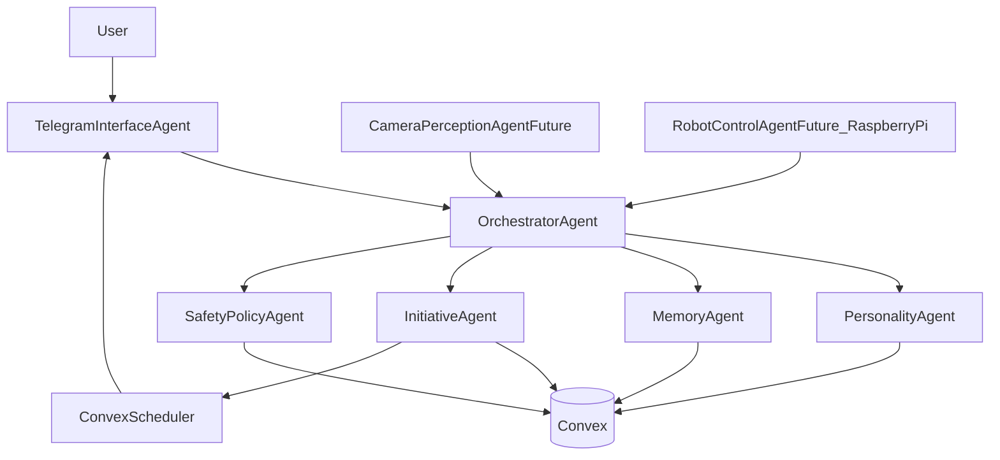

# Persona Architecture

This document is a living architecture record. Update it after each milestone.

## Current State

- Planning completed.
- No runtime services implemented yet.
- Target stack selected:
  - cloud-hosted multi-agent runtime
  - Convex as source-of-truth backend
  - Telegram as first external interface
  - Raspberry Pi reserved for embodiment phases

## Target State

A long-lived, cloud-hosted persona system with:

- multi-agent role separation
- persistent memory and identity state in Convex
- proactive self-initiated messaging
- channel adapters for external communication
- future perception and robot-control adapters

## System Topology

## Agent Responsibilities

### `OrchestratorAgent`

- receives inbound events from channel adapters
- gathers memory, personality state, and initiative context
- requests draft actions from specialized agents
- finalizes and dispatches `ActionIntent` objects

### `PersonalityAgent`

- enforces stable communication style and relational tone
- maps intent to persona-consistent language
- evolves persona state over long interaction history

### `MemoryAgent`

- stores and retrieves short-term and long-term memory
- creates memory episodes from message windows
- provides contextual retrieval for response generation

### `InitiativeAgent`

- creates proactive `InitiativeEvent` candidates
- drafts outbound intents independent of user prompts
- records internal motivation tags for analysis

### `SafetyPolicyAgent`

- classifies intents and confidence levels
- records policy metadata and governance traces
- enables operator controls and auditability

### `TelegramInterfaceAgent`

- ingests inbound Telegram updates
- sends outbound messages with retry and status tracking
- normalizes channel payloads into internal event contracts

## Core Data Model (Convex)

Use Convex as source of truth with append-friendly event records.

- `users`
  - profile fields, user preferences, relationship metadata
- `conversations`
  - channel binding, active state, latest interaction pointers
- `messages`
  - inbound/outbound payloads, timestamps, attribution, delivery state
- `memories`
  - structured user facts, preferences, memory confidence
- `memoryEpisodes`
  - summarized interaction windows with retrieval metadata
- `personaState`
  - tone settings, long-term goals, current internal context
- `initiativeEvents`
  - proactive triggers, motivations, generation context
- `actionIntents`
  - draft/final outbound actions before delivery
- `policyDecisions`
  - safety classifications, reasons, operator overrides
- `scheduledActions`
  - queued future tasks for heartbeat and delayed actions
- `systemEvents`
  - immutable log for replay/debug/analytics

## Event Contracts

Standardize internal contracts for agent interoperability.

- `InboundEvent`
  - source channel, user id, payload, timestamp, correlation id
- `InitiativeEvent`
  - origin, motivation, confidence, recommended timing
- `ContextBundle`
  - memory snapshots, persona state, recent thread summary
- `ActionIntent`
  - content proposal, target user/channel, rationale metadata
- `DeliveryResult`
  - delivery status, channel response id, retry metadata

## Runtime Flows

### 1) Reactive user message flow

1. Telegram adapter emits `InboundEvent`.
2. Orchestrator fetches `ContextBundle`.
3. Personality and memory assist response composition.
4. Safety classifies and logs intent.
5. Telegram adapter sends output and stores `DeliveryResult`.

### 2) Proactive initiative flow

1. Convex scheduler triggers initiative evaluation.
2. Initiative agent generates candidate `InitiativeEvent`.
3. Orchestrator composes outbound `ActionIntent`.
4. Safety classifies and logs decision metadata.
5. Adapter delivers message and persists result.

### 3) Memory consolidation flow

1. Scheduled job batches recent conversation segments.
2. Memory agent creates/updates memory episodes.
3. Retrieval indexes and summaries are refreshed.

## Infrastructure Boundaries

- Cloud runtime:
  - orchestration, language-model calls, channel integration
- Convex:
  - persistence, scheduler triggers, query/mutation APIs
- Raspberry Pi (future):
  - camera feeds, sensor state, actuator command execution

## Extensibility for Embodiment

### Camera perception extension

- Add `CameraPerceptionAgent` adapter that converts raw captures into structured perception events.
- Feed perception events through orchestrator like any other `InboundEvent`.

### Robot control extension

- Add `RobotControlAgent` with explicit command contract:
  - command id, action type, parameters, expected outcome
- Raspberry Pi service executes commands and returns telemetry.

## Observability

- Persist all major events in `systemEvents`.
- Track initiative frequency, response latency, and memory retrieval hit quality.
- Build Convex queries for operator dashboard:
  - recent proactive actions
  - persona consistency metrics
  - channel delivery health

## Security and Governance

- Keep capability boundaries at the agent contract level.
- Use explicit operator override modes before physical execution phases.
- Record every policy classification for traceability.

## Current State / Delta / Gaps / Next Increment

### Delta Since Last Update

- Initial architecture definition created.

### Known Gaps

- concrete Convex schema implementation and indexes
- telegram webhook lifecycle details
- model provider strategy and cost controls
- embodiment transport protocol (Pi <-> cloud)

### Next Increment

Implement chat-only MVP runtime:

1. Convex schema + core queries/mutations.
2. Telegram adapter.
3. Orchestrator + personality + memory loop.
4. Initiative scheduler job with observability hooks.
