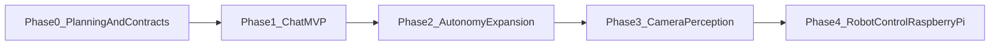

# Persona Implementation Roadmap

## Objective

Deliver a real-like, persistent persona in phases:

1. cloud-native multi-agent conversation
2. autonomous initiative at scale
3. camera perception integration
4. Raspberry Pi robotic embodiment

## Milestone Timeline (phase-based)

## Phase 0: Planning and Contracts

### Goals

- finalize concept, architecture, MVP, autonomy, and roadmap docs
- define event contracts and Convex table/index strategy
- define interface boundaries for channel and embodiment adapters

### Deliverables

- `plans/persona/concept.md`
- `plans/persona/architecture.md`
- `plans/persona/mvp.md`
- `plans/persona/safety-and-autonomy.md`
- contract definitions for `InboundEvent`, `InitiativeEvent`, `ActionIntent`, `DeliveryResult`

### Dependencies

- confirmed product direction for high-autonomy behavior
- deployment target decisions for cloud runtime

### Exit Criteria

- docs approved as baseline
- event contracts stable enough for Phase 1 implementation

## Phase 1: Chat MVP (Telegram + Convex)

### Goals

- build reactive conversation loop
- establish memory continuity
- launch proactive outbound messaging

### Workstreams

- backend:
  - implement Convex schema/tables/indexes
  - implement query/mutation/action surfaces
- agents:
  - orchestrator, personality, memory, initiative, safety classification
- transport:
  - Telegram inbound webhook and outbound sender
- observability:
  - event logging and operator queries

### Dependencies

- Telegram bot credentials
- model provider and prompt strategy
- Convex deployment environment

### Exit Criteria

- inbound and outbound chat stable
- proactive messages sent without manual trigger
- full trace from initiative generation to delivery result

## Phase 2: Autonomy Expansion

### Goals

- improve initiative quality and diversity
- increase robustness of long-running autonomous behavior
- operator-grade introspection and tuning workflows

### Workstreams

- initiative intelligence:
  - richer motivation modeling and stateful self-driven loops
- memory quality:
  - better episodic summarization and retrieval ranking
- evaluation:
  - scenario-based replay and regression testing
- operations:
  - dashboards for initiative behavior and reliability

### Dependencies

- stable Phase 1 telemetry
- baseline engagement data for tuning

### Exit Criteria

- sustained autonomous messaging behavior in production-like usage
- clear operator insight into why messages were initiated
- measurable improvement in initiative diversity and continuity

## Phase 3: Camera Perception Integration

### Goals

- enable physical-world awareness through camera events
- convert visual signals into persona-relevant context

### Workstreams

- Raspberry Pi capture service:
  - frame/event extraction and secure upload
- perception pipeline:
  - cloud processing to structured perception events
- orchestration:
  - integrate perception events into memory and response planning

### Dependencies

- Raspberry Pi camera stack
- cloud storage/transport for image event payloads
- privacy and data-retention policies

### Exit Criteria

- perception events reliably ingested and stored
- persona responses can reference recent camera-derived context
- system remains stable under mixed chat + perception load

## Phase 4: Robot Control (Raspberry Pi)

### Goals

- add constrained physical action capability
- preserve auditability and command traceability

### Workstreams

- command protocol:
  - cloud-to-pi command schema and acknowledgements
- execution service:
  - Pi-side command dispatcher and telemetry reporting
- orchestration integration:
  - action planning connected to robot capability model

### Dependencies

- hardware interface libraries on Raspberry Pi
- safe execution sandbox and fallback behaviors

### Exit Criteria

- robot commands can be issued, executed, and audited end-to-end
- telemetry is linked to originating action intents
- failure paths are visible and recoverable

## Cross-Phase Engineering Tracks

### Data and schema evolution

- apply additive schema migrations in Convex
- preserve backward compatibility across agent versions

### Quality and testing

- contract tests for agent interfaces
- integration tests for channel and scheduler loops
- long-run soak tests for autonomous behavior

### Cost and performance

- monitor model call volume and latency
- optimize memory retrieval and summarization cadence

## Execution Order for Near-Term Work

1. Implement Phase 1 runtime with minimal complexity.
2. Stabilize metrics and observability.
3. Expand initiative sophistication in Phase 2.
4. Integrate camera events before physical actuation.
5. Introduce robot control after perception and orchestration maturity.
