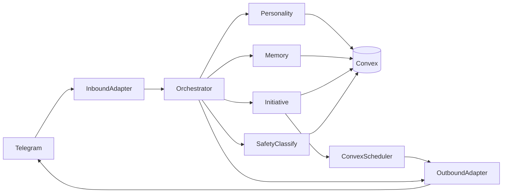

# Persona MVP

## MVP Goal

Ship a cloud-first persona that can:

- communicate through Telegram
- remember user context over time
- proactively message the user without prompts
- maintain stable personality continuity

This MVP intentionally excludes camera perception and robot actuation.

## MVP Scope

### Included

- Multi-agent runtime with:
  - `OrchestratorAgent`
  - `PersonalityAgent`
  - `MemoryAgent`
  - `InitiativeAgent`
  - `SafetyPolicyAgent` (classification and logging)
- Convex backend:
  - core tables for users, messages, memories, initiative events, policy decisions
  - scheduler jobs for initiative and memory consolidation
- Telegram interface:
  - inbound webhook ingestion
  - outbound send/retry and delivery status persistence
- Operator visibility:
  - initiative log views
  - delivery and error analytics queries

### Excluded

- Camera streams and visual perception.
- Raspberry Pi movement control.
- Multi-channel communication beyond Telegram.

## User Stories

1. As a user, I can chat with the persona in Telegram and receive coherent responses.
2. As a user, I can return later and the persona remembers relevant details.
3. As a user, I receive unsolicited messages initiated by the persona.
4. As an operator, I can inspect why proactive messages were generated.

## Functional Requirements

- Reactive loop:
  - process inbound Telegram events and reply with persona-consistent style
- Memory loop:
  - persist interactions and use summaries in future responses
- Initiative loop:
  - trigger autonomous outbound messages through scheduled evaluations
- Policy telemetry loop:
  - classify message intent and persist decision metadata
- Delivery loop:
  - capture send success/failure and retry metadata

## Non-Functional Requirements

- Durable persistence in Convex for all user-visible actions.
- Full traceability from generated intent to delivered message.
- Clear separation between orchestration, memory, and initiative responsibilities.
- Horizontal readiness for future channel and embodiment adapters.

## Acceptance Criteria

### Conversation quality

- Persona responses remain style-consistent across at least 20 mixed interactions.
- Memory retrieval appears in contextually relevant responses.

### Proactive behavior

- System generates autonomous messages without manual triggers.
- Generated proactive messages show varied intent categories:
  - reflection
  - follow-up question
  - suggestion
  - status-like check-in

### Persistence and observability

- Every inbound and outbound message is stored with correlation metadata.
- Every initiative generation stores motivation and classification fields.
- Operator can query last 100 proactive actions with outcome status.

### Reliability

- Outbound delivery retries are persisted and visible.
- Failures remain auditable and do not silently disappear.

## MVP Architecture Slice

## Rollout Plan

### Stage 1: Internal sandbox

- 1-2 operator-controlled user accounts
- validate event model, memory retrieval, and logging completeness

### Stage 2: Limited real usage

- small private user cohort
- track quality of proactive messaging and continuity perception

### Stage 3: Stable MVP

- operational playbook for monitoring and issue triage
- freeze MVP interfaces before embodiment expansions

## Metrics

- `responseLatencyP95`
- `proactiveMessageCountPerDay`
- `initiativeIntentDiversity`
- `memoryReferenceRate`
- `deliveryFailureRate`
- `retrySuccessRate`

## Risks and Mitigations

- Risk: persona inconsistency across long sessions.
  - Mitigation: enforce style memory and episodic summaries.
- Risk: proactive messages become repetitive.
  - Mitigation: track intent distribution and novelty signals.
- Risk: insufficient debugging visibility.
  - Mitigation: enforce event logging for every major transition.

## Definition of Done

MVP is done when:

1. Telegram conversation loop is stable.
2. Memory continuity is demonstrably present.
3. Autonomous proactive messages are running in production-like conditions.
4. Operator can inspect full intent-to-delivery trace for each outbound action.
