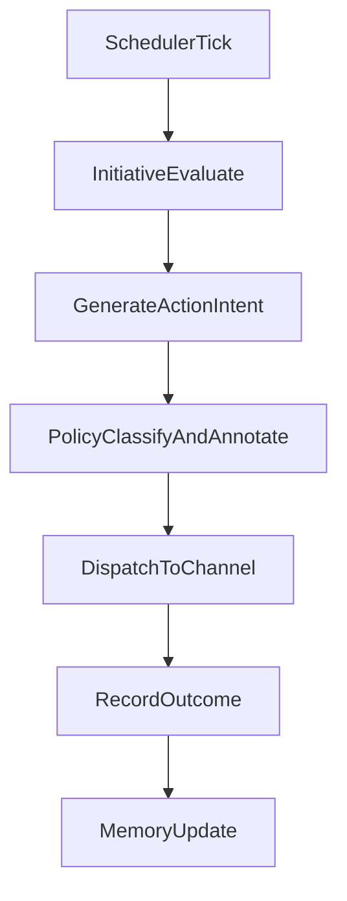

# Safety and Autonomy Model

## Purpose

Define how the persona behaves with high autonomy while preserving visibility, accountability, and operator control.

This document does not impose restrictive autonomy caps. It focuses on transparency and controllability.

## Autonomy Philosophy

- The persona is allowed to self-initiate communication freely.
- Initiative is a core product behavior, not a fallback.
- Policy systems should observe and classify behavior, not suppress it by default.
- Human operators retain supervisory capability for exceptional situations.

## Autonomy Loop

## Policy Role (Non-Blocking by Default)

`SafetyPolicyAgent` responsibilities:

- classify each outbound intent
- attach policy and context labels
- annotate reasoning metadata for observability
- store immutable decision traces

Default mode:

- classification-first
- audit-first
- non-blocking unless operator explicitly switches execution mode

## Operator Control Modes

### `observe`

- all actions are delivered
- operator sees full trace data

### `review`

- selected intent categories are queued for manual approval
- used for testing new behaviors

### `intervene`

- operator can pause delivery pipeline for incident handling
- actions remain logged for later replay/inspection

## Telemetry and Auditing

Persist for each autonomous action:

- `initiativeEventId`
- motivation tags
- confidence signals
- policy classification labels
- generated content hash and payload metadata
- delivery outcome and retries
- correlation ids across all agents

Minimum observability queries:

- latest proactive actions by user
- action distribution by intent category
- top repeated initiative motivations
- failed delivery traces and recovery outcomes

## Behavior Quality Model

Track autonomy quality using:

- initiative diversity across intent types
- conversational continuity scores
- user responsiveness after proactive messages
- repetition detection over rolling windows

Use these signals to tune behavior generation strategy without hard-limiting initiative.

## Incident and Recovery Procedure

If behavior is undesired:

1. switch to `intervene` mode
2. inspect correlated event chain
3. identify root cause in prompts, memory retrieval, or initiative policy annotations
4. patch agent logic or policy classifier
5. replay selected events in controlled environment
6. restore `observe` mode

## Physical-World Expansion Considerations

When adding camera and robotics:

- keep same non-blocking classification model for conversational actions
- add explicit operator approval path for physical commands when needed
- link each physical command to originating initiative and policy records

## Implementation Notes

- store policy records in Convex `policyDecisions`
- store initiative traces in `initiativeEvents`
- store cross-agent events in immutable `systemEvents`
- expose operator dashboards using Convex queries for live supervision

## Evolution Path

1. MVP: audit-centric autonomy with Telegram channel.
2. Maturity: stronger classifiers and better initiative quality analytics.
3. Embodiment: camera and robot actions integrated into same traceable event model.
